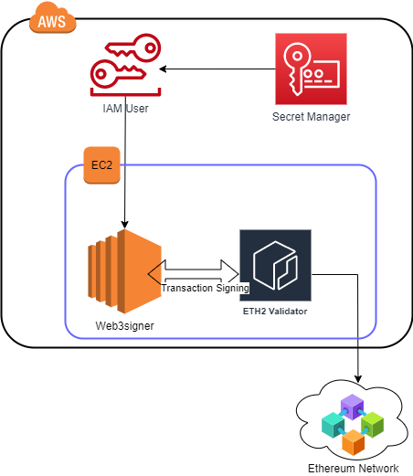

# Web3signer + AWS secret manager + Eth2 validator(prysm)




## pre requisite
 
 Install docker & Java > v11

 ``` sudo apt install openjdk-17-jdk docker.io docker```
  
  Get the Web3signer and extract, pls mind for version and may change

  ```wget https://artifacts.consensys.net/public/web3signer/raw/names/web3signer.tar.gz/versions/22.11.0/web3signer-22.11.0.tar.gz```
  
  
### Place the below files in respective dir.
### Place the config.yaml file to $HOME/config and awsauth.yaml to $HOME/auth folder.
 Customisation Note : Update the AWS auth secret keys, secret id, and bc network in respective files.

  ```config.yaml, awsauth.yaml, DecryptKeystore.java```
  
  ``` Ports : 9000 for websigner```
   
## Create the secret manager with private key from validator_keys.zip file.

### Create a private key and follow to create the Secret manger id.
```
Place `DecryptKeystore.java`  file in web3signer extract folder  and invoke it as `java -cp "lib/*" ./DecryptKeystore.java ./keystore-xxx.json`
```


## Start the Web3signer

 ```
 docker run -d --rm -p 9000:9000 -v $HOME/data:/data -v $HOME/auth:/signkeys -v $HOME/config:/config  --name websigner consensys/web3signer:latest  --config-file=/config/config.yaml --key-store-path=/signkeys eth2
 ```

### Get public_key,  can extract from the validator_zip/keystore-xxxx.json file. 
```
cat keystore-1.json | jq | grep pubkey
``` 

## Start the Validator node

```
BEACON_HOST="18.170.40.156:4000"
PUBLIC_KEY="0x8765299965b8f6f20f5c3c530ff2cde5bd5c1982b3656df8aad14088fbf7312260ea8713fd5332415f304f89fa0b9d0d"

 docker run -d --rm -v $HOME/wallet:/wallet -v $HOME/Eth2db:/validatorDB --network="host" --name validator gcr.io/prysmaticlabs/prysm/validator:stable --beacon-rpc-provider=$BEACON_HOST --wallet-dir=/wallet --datadir=/validatorDB  --suggested-fee-recipient=0x7D3B65e09BE3bC01b02682832Ada6A010899d835 --prater  --validators-external-signer-url=http://localhost:9000 --validators-external-signer-public-keys=$PUBLIC_KEY
```

 

  
